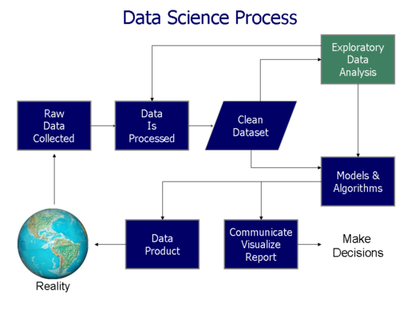
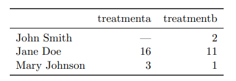
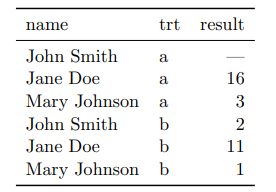

# Introducción

El **análisis exploratorio de datos** es una forma de analizar datos definido por John W. Tukey (E.D.A.: Exploratory data analysis) es el tratamiento estadístico al que se someten las muestras recogidas durante un proceso de investigación en cualquier campo científico. Para mayor rapidez y precisión, todo el proceso suele realizarse por medios informáticos, con aplicaciones específicas para el tratamiento estadístico. 

## Diagrama de flujo del proceso de ciencia de datos
John W. Tukey escribió el libro Análisis de datos exploratorios en 1977. Tukey sostuvo que se puso demasiado énfasis en las estadísticas en las pruebas de hipótesis estadísticas (análisis de datos confirmatorios); Se necesitaba poner más énfasis en el uso de datos para sugerir hipótesis para probar. En particular, sostuvo que confundir los dos tipos de análisis y emplearlos en el mismo conjunto de datos puede conducir a un sesgo sistemático debido a los problemas inherentes a las hipótesis de prueba sugeridas por los datos.

Los objetivos de EDA son:

* Sugerir hipótesis sobre las causas de los fenómenos observados.
* Evaluar los supuestos en los que se basará la inferencia estadística
* Apoyar la selección de herramientas y técnicas estadísticas apropiadas.
* Proporcionar una base para una mayor recopilación de datos a través de encuestas o experimentos

Muchas técnicas de EDA se han adoptado en la minería de datos. También se les está enseñando a los jóvenes estudiantes como una forma de presentarles el pensamiento estadístico.

## Datos limpios (clean dataset)

Los principios de datos limpios ([Tidy Data de Hadley Wickham](http://vita.had.co.nz/papers/tidy-data.pdf)) proveen una manera estándar de organizar la información:

* Cada variable forma una columna.
* Cada observación forma un renglón.
* Cada tipo de unidad observacional forma una tabla.

Vale la pena notar que los principios de los datos limpios se pueden ver como teoría de algebra relacional para estadísticos, estós principios equivalen a la tercera forma normal de Codd con enfoque en una sola tabla de datos en lugar de muchas conectadas en bases de datos relacionales.

¿ Cuál de las sigiuentes tablas se ajusta al principio de datos limpios ?. 

**Caso 01**

**Caso 02**

### Checklist en el análisis exploratorio de datos

En el contexto de procesamiento de datos, el análisis exploratorio de datos debería dar respuestas a las siguientes preguntas:

1. ¿Qué pregunta (s) estás tratando de resolver (o probar que estás equivocado)?
2. ¿Qué tipo de datos tiene y cómo trata los diferentes tipos?
3. ¿Qué falta en los datos y cómo los maneja?
4. ¿Qué hacer con los datos faltantes, outliers o información mal inputada?
5. ¿Se puede sacar más provecho a los datos ?
