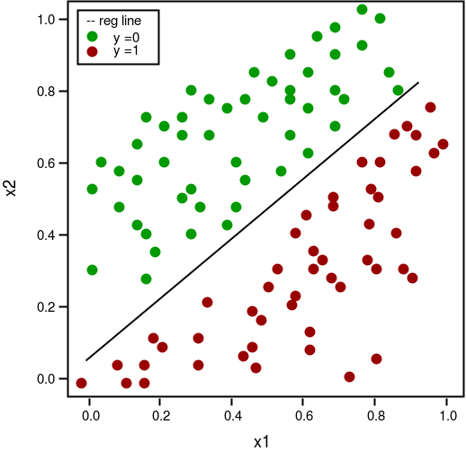

# Aprendizaje supervisado - Clasificación

Los modelos de clasificacion son ocupadas para predecir valores categóricos, por ejemplo, determinar la especie de una flor basado en el largo (y ancho) de su pétalo (y sépalo).
Dentro de los modelos de clasificación, el modelo más básico (y no por eso menos importante) es el **modelo de regresión logística**.

